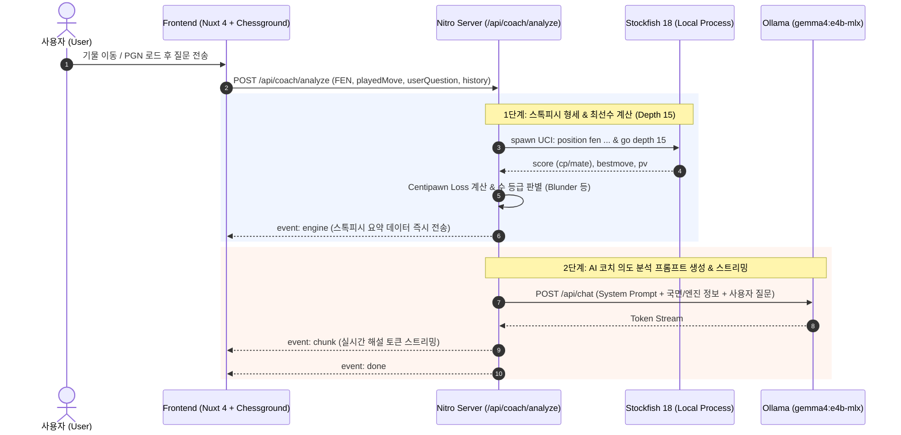

# ♟️ AI Chess Coach (의도 분석 대화형 AI 체스 코치)

[](https://ui.nuxt.com)
[](https://stockfishchess.org/)
[-orange)](https://ollama.com/)

**AI Chess Coach**는 체스 플레이어의 착상과 심리적 의도를 분석하고, 강력한 체스 엔진(Stockfish)의 정밀한 계산과 로컬 LLM(Ollama / Gemma 4)의 친절한 그랜드마스터 코칭을 결합한 **대화형 AI 체스 코칭 웹 애플리케이션**입니다.

> 💡 This project is built upon the official [Nuxt AI Chatbot Template](https://github.com/nuxt-ui-templates/chat).

---

## 🌟 핵심 기능 (Key Features)

### 1. 좌우 2단 분할 인터랙티브 UI (Split Screen)
- **좌측 체스보드 패널**:
  - [Chessground](https://github.com/lichess-org/chessground)와 [chess.js](https://github.com/jhlywa/chess.js)를 결합한 부드러운 드래그 앤 드롭 및 합법적 이동 제한.
  - **PGN 기보 불러오기**: 전체 PGN 텍스트 입력 및 모피의 오페라 게임, 카스파로프 불멸의 대국, 실전 블런더 예제 1클릭 로드.
  - **수순 탐색기 (Move Navigator)**: 처음, 이전 수, 다음 수, 마지막 수 이동 버튼 및 키보드 방향키 탐색 지원.
  - **기보 목록 (Move History)**: Chess.com 스타일 수별 평가 뱃지(Blunder, Mistake, Inaccuracy, Best, Miss) 및 국면 이동.
  - **최선수 & 수 등급 시각화**: 스톡피시가 계산한 최선수 화살표(Green Arrow), 마지막 수 하이라이트 및 실시간 형세 게이지.
- **우측 AI 코치 채팅 패널**:
  - 자연어로 질문 입력 (예: *"여기서 14.Nd4 둔 게 비숍을 공격하려던 건데 왜 블런더야?"*).
  - 국면별 추천 질문 칩 제공 (의도 분석, 최선수 질문, 상대 위협 파악 등).
  - **스톡피시 분석 요약 카드**: 평가치(+1.4, -3.2, M2), 수 등급(Blunder, Mistake, Inaccuracy, Good, Best Move), 최선수, 추천 라인(PV).
  - **실시간 SSE 스트리밍**: AI 코치의 4단계 분석 해설(의도 공감 ➡️ 전술적 반격 ➡️ 최선수 원리 ➡️ 원포인트 레슨) 실시간 생성.

---

## 🏗️ 시스템 아키텍처 & 데이터 흐름



---

## 📋 사전 요구사항 (Prerequisites)

1. **Stockfish 체스 엔진 설치**:
   - macOS (Homebrew):
     ```bash
     brew install stockfish
     ```
     기본 경로: `/opt/homebrew/bin/stockfish` (환경 변수 `STOCKFISH_PATH`로 변경 가능)
2. **Ollama & Gemma 4 모델 설치**:
   - [Ollama](https://ollama.com/) 실행 후 모델 다운로드:
     ```bash
     ollama run gemma4:e4b-mlx
     ```
     (환경 변수 `OLLAMA_BASE_URL` 및 `OLLAMA_MODEL`로 커스텀 설정 가능)

---

## 🚀 빠른 시작 (Getting Started)

### 1. 패키지 설치

```bash
pnpm install
```

### 2. 환경 변수 설정 (선택 사항)

`.env` 파일에 필요한 설정을 구성합니다:

```bash
# Stockfish 실행 경로 (기본값: /opt/homebrew/bin/stockfish)
STOCKFISH_PATH=/opt/homebrew/bin/stockfish

# Ollama 엔드포인트 및 모델명
OLLAMA_BASE_URL=http://localhost:11434
OLLAMA_MODEL=gemma4:e4b-mlx
```

### 3. 개발 서버 실행

```bash
pnpm dev
```

브라우저에서 [http://localhost:3000](http://localhost:3000)으로 접속합니다.

### 4. 타입 검사 & 프로덕션 빌드

```bash
# TypeScript 타입 검사
pnpm typecheck

# 프로덕션 빌드
pnpm build

# 빌드 미리보기
pnpm preview
```

---

## 🛠️ 기술 스택 (Tech Stack)

- **Frontend**: Nuxt 4, Vue 3, Nuxt UI v3/v4, Tailwind CSS, `@lichess-org/chessground`, `chess.js`
- **Backend / API**: Nuxt Nitro, Server-Sent Events (SSE), Node.js `child_process`
- **Chess Engine**: Stockfish 18 (UCI Protocol)
- **AI / LLM**: Ollama (`gemma4:e4b-mlx`), Vercel AI SDK
- **Icons & Markdown**: Nuxt Icon, `@comark/nuxt`, Shiki

---

## 👏 Acknowledgments & Credits

This project was built upon the [Nuxt AI Chatbot Template](https://github.com/nuxt-ui-templates/chat) by the Nuxt UI team, extending it with interactive chess board integration ([Chessground](https://github.com/lichess-org/chessground), [chess.js](https://github.com/jhlywa/chess.js)), local Stockfish 18 engine analysis, and local Ollama coaching capabilities.
